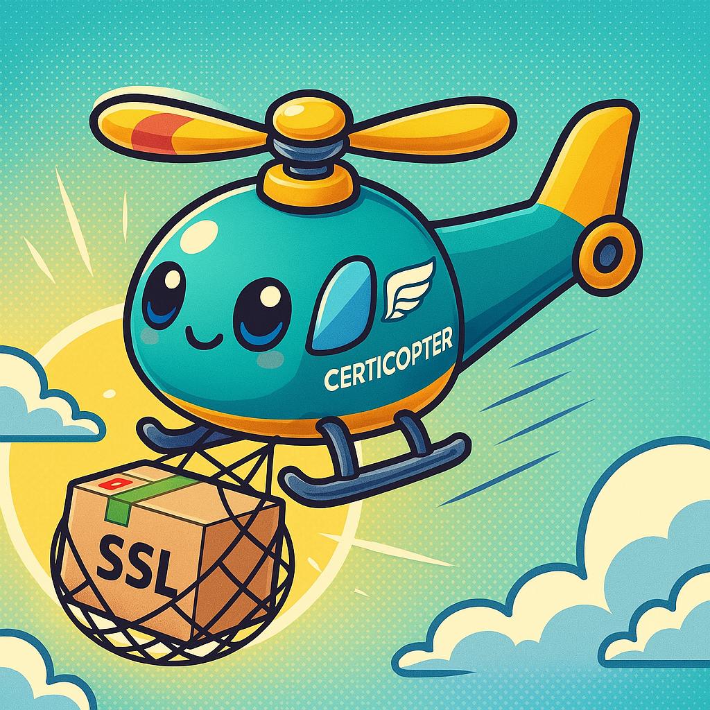

<a id="readme-top"></a>

<h1 align="center">Certicopter</h3>

<!-- PROJECT LOGO -->
<br />
<div align="center">

  <a href="https://github.com/amanoxsolutions/certicopter">
    
  </a>
  <p align="center">
    A lightweight application to renew your SSL certificates in an automated fashion
    <br />
  </p>
</div>

<!-- TABLE OF CONTENTS -->
<details>
  <summary>Table of Contents</summary>
  <ol>
    <li>
      <a href="#about-the-project">About The Project</a>
    </li>
    <li>
      <a href="#getting-started">Getting Started</a>
        <ul>
          <li><a href="#prerequisites">Prerequisites</a></li>
          <li><a href="#setup">Setup</a></li>
          <li><a href="#usage">Usage</a></li>
          <li><a href="#recurring-renewal">Recurring Renewal</a></li>
          <li><a href="#configuration">Configuration</a></li>
        </ul>
    </li>
    <li><a href="#documentation">Documentation</a></li>
    <li><a href="#roadmap">Roadmap</a></li>
    <li><a href="#contribution">Contribution</a></li>
    <li><a href="#contact">Contact</a></li>
    <li><a href="#acknowledgments">Acknowledgments</a></li>
    <li><a href="#license">License</a></li>
  </ol>
</details>


<!-- ABOUT THE PROJECT -->
## About The Project

Managing SSL certificates manually across multiple systems is time-consuming, error-prone, and can lead to service outages if certificates expire unexpectedly. This tool is designed to automate SSL certificate renewal across various environments, ensuring that your applications and services remain secure and compliant without the hassle of manual intervention.

By supporting multiple systems, it simplifies certificate management for developers, sysadmins, and DevOps teams alike.

* Prevent downtime due to expired certificates
* Maintain strong HTTPS security standards
* Save time with reliable automation
* Standardize renewal workflows across different platforms
* Centralized management for certificates and logging
* No SPOF due to wildcard certificates (each instance get's a unique domain specific certificate)
* Easily scalable

<p align="right">(<a href="#readme-top">back to top</a>)</p>

### Built With

* [![Python][Python]][Python-url]
* [![Docker][Docker]][Docker-url]

### Integrated systems

* [![Nutanix][Nutanix]][Nutanix-url]
* [![Rubrik][Rubrik]][Rubrik-url]
* [![Hycu][Hycu]][Hycu-url]
* [![PaloAlto][PaloAlto]][PaloAlto-url]
* [![Loadbalancer][Loadbalancer]][Loadbalancer-url]
* [![vSphere][vSphere]][vSphere-url]

<p align="right">(<a href="#readme-top">back to top</a>)</p>

<!-- GETTING STARTED -->
## Getting Started

Follow these steps to get the tool up and running:

### Prerequisites

1. **System Requirements**
   - Python v3.13 or higher
   - Docker Engine v28.1.1 or higher
   - Git v2.49.0 or higher
   - GNU Bash v5.2.0 or higher

2. **System Access**
   - Access to target systems
   - API tokens or credentials for authentication

> ⚠️ **Important:** Certicopter does not provide built-in interfaces for resolving or securing credentials. All sensitive information - such as passwords, usernames, domain names, API tokens, and similar - is expected to be supplied via environment variables. The mechanism responsible for storing and providing these environment variables must be maintained by the user.

> As part of the setup, users receive a template tailored to their requirements. This template includes a checklist of the necessary environment variables but does not handle the provisioning or secure storage.

3. **Network Requirements**
   - HTTPS/HTTP access to target systems
   - DNS resolution for target domains
   - Port access (varies by system and your configurations, typically 80, 443, 8443, 9440, 9443)

### Setup

1. Clone the repository
   ```sh
   git clone https://github.com/amanoxsolutions/certicopter.git
   ```

2. Execute the `setup.sh` file
- Open Git Bash and navigate to the project folder
   ```sh
   cd PathTo/certicopter
   ./setup.sh
   ```

> ⚠️ **Important:** If you encounter an error while trying to execute one of the shell scripts mentioned above, you may need to modify its execution permissions. As an example:
>```sh
>chmod +x setup.sh
>```
>  If you encounter syntax errors while executing the script, it's likely due to using the wrong shell. Always open and run the script in the Git Bash shell to avoid such errors.

3. Enter all necessary information
   - DNS hosting provider (only those that are offered from Certbot -> [DNS Plugins](https://eff-certbot.readthedocs.io/en/latest/using.html#dns-plugins))
   - Notification email address
   - Save certificates locally or not
   - Systems used
   - Instances per system

4. Create the necessary environment variables in your secrets manager depending on your internal architecture
    - Use the `env_template.env` file created by the `setup.sh`
    - The environment variables on your side must match those in the template for the script to correctly resolve the values

> 📌 If you do not have a dedicated infrastructure or system for securely storing and managing your credentials (and providing them as environment variables), you can create a `.env` file. Then, add the `'env_file'` tag to the `docker-compose.yml` file to use this method.

5. Enable Hosting Provider Plugin
    - Go to the `SSL_Certificate_App/requirements.txt` and activate the plugin depending on what hosting provider you have chosen
    - To activate it, remove the `#` in front of your `certbot-dns-exampleprovider`

### Usage

1. **Guided Execution** (recommended)
  - Execute the `run.sh` file in the project directory
    ```sh
    ./run.sh
    ```

2. **Docker Standalone Execution**
   ```sh
   docker compose up --build
   ```

### Recurring Renewal

To ensure your SSL certificates are automatically renewed before they expire, you should set up a recurring task (we suggest performing this in a monthly fashion). Here are the recommended approaches as examples:

1. **Using a Cron Job**
   - Edit your crontab: `crontab -e`
   - Add a monthly job:
     ```bash
     0 0 1 * * /path/to/certicopter/run.sh --noninteractive
     ```
> 📌 The above command executes the shell script on a monthly basis at midnight without the need for manual interaction.

2. **Using Windows Task Scheduler**
   - Open Task Scheduler
   - Create a new Task
   - Set the trigger to Monthly
    - Select all months
    - Set day to 1
    - Start time: 00:00
   - Action: Start a program
   - Program/script: `C:\Program Files\Git\bin\bash.exe`
   - Add arguments: `-c "/c/User/path/to/certicopter/run.sh --noninteractive"`

> ⚠️ **Important:** 
> - Ensure the scheduling interval is less than your certificate validity period (< 90 days)
> - Monitor the logs for successful renewals
> - Test the renewal process manually before setting up automation

<p align="right">(<a href="#readme-top">back to top</a>)</p>

### Configuration

The application uses a JSON-based configuration file (`config.json`) with the following example structure (generated automatically with the setup process):

```json
{
  "certicopter_global_settings": {
    "hosting_provider": "example_provider",
    "notification_email": "example.email@example.com",
    "save_certificates": "y"
  }
  "providers": {
    "nutanix|paloalto|vsphere|rubrik|hycu|vamax": {
      "instances": [
        {
          "domain_env_var": "PROVIDER_INSTANCE_1_DOMAIN",
          "username_env_var": "PROVIDER_INSTANCE_1_USERNAME",
          "password_env_var": "PROVIDER_INSTANCE_1_PASSWORD"
        },
        {
          "domain_env_var": "PROVIDER_INSTANCE_2_DOMAIN",
          "username_env_var": "PROVIDER_INSTANCE_2_USERNAME",
          "password_env_var": "PROVIDER_INSTANCE_2_PASSWORD"
        }
      ]
    }
  }  
}
```

<p align="right">(<a href="#readme-top">back to top</a>)</p>

<!-- DOCUMENTATION -->
## Documentation

Documentation for this project can be found in the `docs/` directory:

- `app_architecture` - Explanation how the application in general and it's components work
- `coding_guidelines.md` - Coding standards and best practices
- `enpoints.md` - API documentation and endpoints
- `common_errors.md` - List of most common errors that can happen during execution

Additional documentation is available in the code comments and docstrings. The main README provides only a high-level overview of the project.

<p align="right">(<a href="#readme-top">back to top</a>)</p>

<!-- ROADMAP -->
## Roadmap

- [x] Initial release with basic functionality
- [x] Support for multiple systems
- [x] Automated certificate renewal
- [x] Basic error handling and logging
- [ ] Basic testing coverage
- [ ] CI/CD pipeline
- [ ] Additional system integrations

<p align="right">(<a href="#readme-top">back to top</a>)</p>

<!-- CONTRIBUTION -->
## Contribution

Contributions are what make the open source community such an amazing place to learn, inspire, and create. Any contributions you make are **greatly appreciated**.

If you have a suggestion that would make this better, please fork the repo and create a pull request.

1. Fork the Project
2. Create your Feature Branch (`git checkout -b feature/NewFeature`)
3. Commit your Changes (`git commit -m 'Added a new feature'`)
4. Push to the Branch (`git push origin feature/NewFeature`)
5. Open a Pull Request

<p align="right">(<a href="#readme-top">back to top</a>)</p>

<!-- CONTACT -->
## Contact

Axians Amanox AG - [Website](https://amanox.ch) - opensource@amanox.ch

Project Link: [https://github.com/amanoxsolutions/certicopter](https://github.com/amanoxsolutions/certicopter)

<p align="right">(<a href="#readme-top">back to top</a>)</p>

<!-- ACKNOWLEDGMENTS -->
## Acknowledgments

* [Let's Encrypt](https://letsencrypt.org/)
* [Certbot](https://certbot.eff.org/)

<p align="right">(<a href="#readme-top">back to top</a>)</p>

<!-- LICENSE -->
## License

This project is licensed under the Apache License 2.0. See the LICENSE file for details.

<p align="right">(<a href="#readme-top">back to top</a>)</p>

<!-- MARKDOWN LINKS & IMAGES -->
<!-- https://www.markdownguide.org/basic-syntax/#reference-style-links -->
[Python]: https://img.shields.io/badge/Python-3776AB?style=for-the-badge&logo=python&logoColor=white
[Python-url]: https://python.org/

[Docker]: https://img.shields.io/badge/Docker-2496ED?style=for-the-badge&logo=docker&logoColor=white
[Docker-url]: https://www.docker.com/

[Nutanix]: https://img.shields.io/static/v1?label=&message=Nutanix&color=024DA1&logo=nutanix&logoColor=FFFFFF&style=for-the-badge
[Nutanix-url]: https://www.nutanix.com

[Rubrik]: https://img.shields.io/static/v1?label=&message=Rubrik&color=00B388&logo=rubrik&logoColor=FFFFFF&style=for-the-badge
[Rubrik-url]: https://www.rubrik.com

[HYCU]: https://img.shields.io/static/v1?label=&message=HYCU&color=6C2DC7&logo=hycu&logoColor=FFFFFF&style=for-the-badge
[HYCU-url]: https://www.hycu.com/

[PaloAlto]: https://img.shields.io/static/v1?label=&message=Palo%20Alto%20Networks&color=F04D1E&logo=paloaltonetworks&logoColor=FFFFFF&style=for-the-badge
[PaloAlto-url]: https://www.paloaltonetworks.com/

[Loadbalancer]: https://img.shields.io/badge/Loadbalancer.org-54009C?style=for-the-badge&labelColor=000000&color=54009C
[Loadbalancer-url]: https://www.loadbalancer.org/

[vSphere]: https://img.shields.io/static/v1?label=&message=vSphere&color=0078D4&logo=vmware&logoColor=FFFFFF&style=for-the-badge
[vSphere-url]: https://www.vmware.com/products/cloud-infrastructure/vsphere
